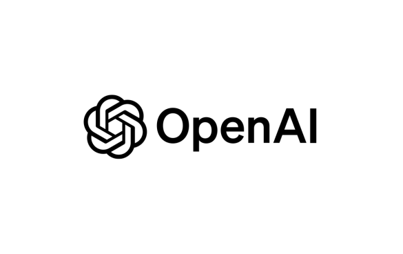

# OpenAI Playground User Manual

## Introduction
The [OpenAI Playground](https://platform.openai.com/playground/) is an interactive environment that allows users to explore the capabilities of OpenAI's language models. It provides an interface to generate outputs for various reasons, including editing advice, coding advice, and more.

## Overview of Features
- **Interactive Prompts:** Enter text prompts to interact with OpenAI's language models.
- **Adjustable Parameters:** Control settings like temperature, maximum tokens, and top-p for tailored outputs.
- **Prebuilt Examples:** Quickly understand the models' capabilities through preloaded scenarios.
- **Save and Share:** Save your session configurations or share them with others via unique links.

# Step-By-Step Guide

## 1. Accessing Playground
Visit the [OpenAI Playground](https://platform.openai.com/playground/) and log in with your OpenAI account credentials.

## 2. Entering a Prompt
In the input box, type your desired text prompt. For example:

```
Write a short story about a Document Engineering Class at Allegheny College.
```

```On a crisp autumn morning at Allegheny College, students shuffled into a brightly lit classroom, ready for another session of Document Engineering. Professor Hayes, known for her engaging teaching style, greeted the class with a warm smile.

"Good morning, everyone," she said, setting down her coffee mug. "Today’s class will be a bit different. I want you to think about what makes a document useful and intuitive."

The students exchanged curious glances as Professor Hayes handed out examples of various digital documents—some were sleek and professional, while others were cluttered and confusing.

"Your task," she continued, "is to analyze these and identify what works and what doesn’t. By the end of today’s session, I want each of you to sketch out improvements for one of these documents."

Among the students were Mia and Oliver, both eager to dive into the assignment. Mia selected a convoluted webpage with mismatched fonts and confusing navigation, while Oliver chose a cluttered event flyer.

"This webpage feels like a maze," Mia muttered to Oliver as they worked side by side. "I can’t even tell where to start."

Oliver chuckled. "This flyer is worse. I think they used five different fonts. It’s giving me a headache."

Throughout the class, Professor Hayes moved around the room, offering feedback and encouragement. "Remember," she said, "a well-designed document doesn’t just look good—it communicates effectively."

As the session wrapped up, the students presented their ideas. Mia proposed a streamlined layout for her webpage, emphasizing clear navigation and consistent styling. Oliver’s redesign focused on simplifying the flyer’s content and using a cohesive color scheme.

"Great work, everyone," Professor Hayes said, nodding in approval. "Keep these principles in mind as we move forward. Document design is an evolving process, and there’s always room for improvement."

Walking out of class, Mia turned to Oliver. "This was actually pretty fun."

"Yeah," Oliver agreed. "It’s like solving a puzzle—but with words and layouts."

The students headed off to their next classes, feeling inspired by the day’s discussion and ready to tackle the challenges ahead.
```


## 5. Saving and Sharing

You may save, or copy and paste your work using a custom link.

---

## Tips and Best Practices

- **Use concise and clear prompts** to get more accurate results.
- **Experiment with parameter settings** to understand their impact on output.
- **Explore prebuilt examples** to get inspiration for your own use cases.
- **Save frequently used prompts and configurations** for efficiency.

---

## Examples

**Prompt:**  
*Write a sentence or two on how Calculus helps CS majors.*

**Generated Output:**  
Calculus helps Computer Science majors develop problem-solving and analytical skills essential for understanding algorithms, optimizing performance, and modeling complex systems. Concepts like derivatives and integrals are often applied in areas such as machine learning, computer graphics, and simulation.

---

## Frequently Asked Questions (FAQ)

**What is the OpenAI Playground?**  
The OpenAI Playground is a tool for exploring and interacting with OpenAI's language models in a user-friendly interface.

**Do I need an account to use the Playground?**  
Yes, you need to create an OpenAI account to access the Playground.

**Can I save my work in the Playground?**  
Yes, you can save your settings and sessions to revisit them later or share with others.

---

## Table of Dos and Don'ts

| **Do**                                | **Don't**                            |
|---------------------------------------|---------------------------------------|
| Use AI to broaden your ideas and knowledge. | Use AI to do your work for you.      |


For more information, visit the official [OpenAI Playground](https://platform.openai.com/playground/) page.


